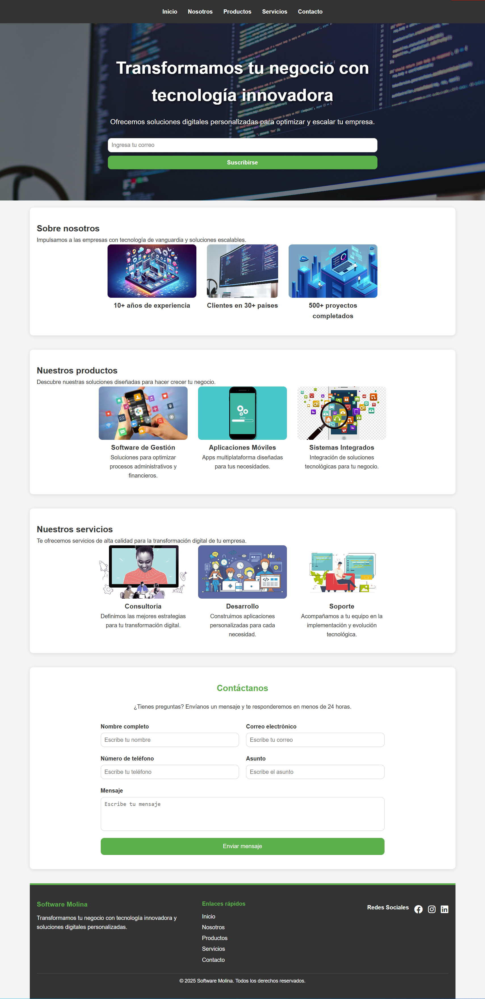

# PROYECTO 3: Landing de Negocio - Software Molina

## Descripción del Proyecto
Este proyecto consiste en el desarrollo de una página web estática para Software Molina, diseñada como una landing page personalizada. La landing tiene como objetivo presentar la propuesta de valor de la empresa, destacar sus productos y servicios, y ofrecer una interfaz moderna y responsiva utilizando **HTML5** y **CSS3**.

La página incluye las siguientes secciones:
1. **Header**: Con el logo y las áreas principales del sitio.
2. **Hero**: Presenta un mensaje de bienvenida con un formulario de suscripción.
3. **Sobre Nosotros**: Breve descripción de la empresa y sus logros destacados.
4. **Productos**: Catálogo con imágenes y descripciones de los productos.
5. **Servicios**: Detalle de los servicios que ofrece la empresa.
6. **Contacto**: Formulario para que los usuarios puedan enviar consultas.
7. **Footer**: Enlaces rápidos y redes sociales.

---

## Funcionalidades Principales
1. **Diseño Responsivo**:
   - Optimizado para dispositivos móviles y escritorio utilizando media queries.

2. **Formulario de Suscripción**:
   - En la sección **Hero**, los usuarios pueden ingresar su correo electrónico para recibir información.

3. **Catálogo de Productos**:
   - Incluye imágenes y descripciones de productos destacados.

4. **Interacción con el Usuario**:
   - Los usuarios pueden navegar fácilmente por las secciones principales mediante un menú interactivo.

---

## Demo
Accede a la demo del proyecto: [Demo en GitHub Pages](https://github.com/usuario/software-molina-landing)

---

## Tecnologías Utilizadas
- **HTML5**: Estructuración del contenido.
- **CSS3**: Diseño y estilos, utilizando:
  - Flexbox y Grid para la organización de elementos.
  - Media Queries para hacer la página responsiva.
- **Font Awesome**: Íconos para redes sociales.

---

## Requisitos del Proyecto
1. **Header**: Incluye el logo y las áreas principales del sitio.
2. **Main**:
   - Presentación del mensaje del negocio.
   - Formulario para ingresar el correo.
3. **Productos**:
   - Mostrar un catálogo breve con imágenes y descripciones.
4. **Footer**:
   - Incluir enlaces rápidos y redes sociales.
5. **Responsive Design**:
   - Optimización para móviles.

---

## Objetivos de Aprendizaje
- Utilizar etiquetas estándar de HTML5.
- Aplicar estilos CSS de forma eficiente.
- Crear interfaces responsivas con Flexbox y CSS Grid.
- Desarrollar un prototipo inicial para el diseño.

---

## Imágenes del Proyecto

